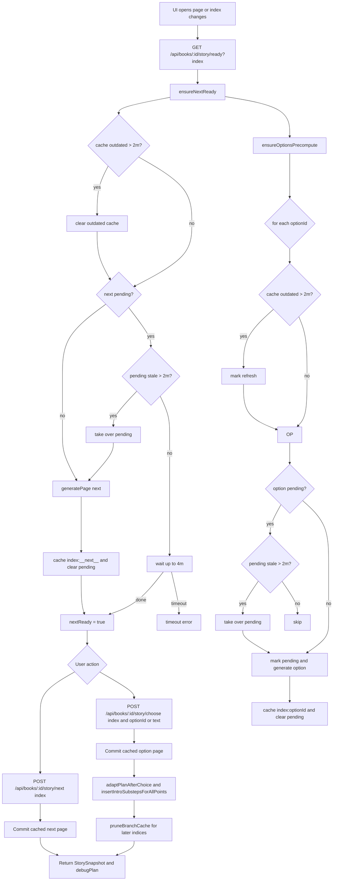

  
  

<h1 align="center">TaleTwo</h1>

Interactive, branching stories generated with a plan-first LLM engine.

## How it works (logic)

- **Plan-first engine**: When a story is started, the backend builds a high-level plan of points and substeps and injects intro substeps for characters, concepts, and items specific to the story.

- **Page generation**: Each page is produced by `generatePage()` using substep-focused prompts that keep the plan hidden from the reader while orienting diegetically. Global style guidance (lean, concrete prose; POV integrity; sentence discipline) is enforced via `buildSystemPromptFromConfig()`.

- **Readiness and caching**: For every page index, the backend precomputes and caches the default continuation and option branches in `story.branchCache` using keys like `${index}:__next__` and `${index}:${optionId}`. `ensureNextReady()` blocks until the default next is ready; `ensureOptionsPrecompute()` warms missing option branches. A `branchPending` map prevents duplicate work. Stale cache or pending entries older than 2 minutes are cleared or taken over; waiting for someone else’s generation times out after 4 minutes.

- **UI gating**: The frontend polls `/api/books/:id/story/ready?index=...` and only enables the Next button when `next` is ready and choice buttons when their branches are ready. This guarantees immediate commits on click (no synchronous generation fallbacks). See `src/stores/story.ts`, `src/views/PlayView.vue`, and `src/components/ChoicesList.vue`.

- **Advancing and choosing**:
  - Next: `POST /api/books/:id/story/next` with `{ index }` commits the cached `${index}:__next__` page.
  - Choice: `POST /api/books/:id/story/choose` with `{ index, optionId|text }` commits the selected branch and adapts the plan. Caches for indices greater than the current index are pruned; historical caches are retained.

- **Suggestions and constraints**: Book setup suggestions come from `/api/books/:id/config?s=...`. For `books`, the model is constrained to US public‑domain titles and guarded at runtime. See `getConfigSuggestions()` in `backend/src/lib/llm.ts`.

- **Diagnostics**: Each snapshot includes a `debugPlan` that the frontend logs as a compact Markdown summary for debugging.

## Story generation flow

Rendered version (for viewers without Mermaid support):

## Technology

- **Frontend** (Vite + Vue 3):
  - Vue 3, Pinia, Vue Router (`src/`), Tailwind CSS v4, @vueuse/core, Vue Matomo.
  - Firebase (web) for auth token handling.
  - Key files: `src/main.ts` (app + localStorage migration to `taletwo.*`), `src/router/index.ts`, `src/stores/story.ts` (readiness polling, index-based API), `src/lib/api.ts`, `src/views/PlayView.vue`, `src/components/ChoicesList.vue`.

- **Backend** (Bun + TypeScript):
  - Minimal HTTP server in `backend/src/index.ts` with CORS and JSON helpers.
  - Story engine in `backend/src/lib/story.ts` (planning, substeps, generation, readiness) and LLM orchestration in `backend/src/lib/llm.ts` (chat + prompts).
  - MongoDB persistence via `backend/src/lib/db` and Firebase Admin auth via `backend/src/lib/auth` (`Authorization` bearer token required).
  - Endpoints: `/api/books` (CRUD-ish list/create), `/api/books/:id` (get), `/api/books/:id/story` (get snapshot or auto-start), `/story/start`, `/story/ready?index=...`, `/story/next`, `/story/choose`, `/config` (GET suggest, POST set).
  - Logging is to stdout; no prompt log files.

- **Environment**:
  - Frontend: Node 20+ (Vite) — see `package.json`.
  - Backend: Bun runtime — see `backend/package.json`.

---

For development and deployment details, see the source files and scripts in `package.json` and `backend/package.json`.
